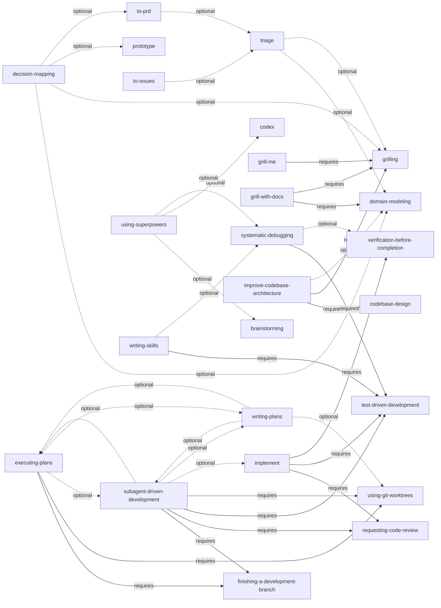

<!-- Generated from skills-manifest.yaml; do not edit manually. -->

# Skill dependency graph

Solid edges are required installation dependencies. Dashed edges are optional workflow integrations. Informational references are omitted.

## Declared dependencies

| Skill | Required | Optional |
|---|---|---|
| adapter-pattern | — | — |
| atomic-file-write | — | — |
| binary-distribution | — | — |
| brainstorming | — | — |
| caveman | — | — |
| cdsv2 | — | — |
| codebase-design | — | — |
| codex | — | — |
| decision-mapping | — | `domain-modeling`, `grilling`, `prototype`, `to-prd` |
| design-an-interface | — | — |
| dispatching-parallel-agents | — | — |
| domain-modeling | — | — |
| embedded-fixtures | — | — |
| executing-plans | `finishing-a-development-branch`, `using-git-worktrees` | `subagent-driven-development`, `writing-plans` |
| finishing-a-development-branch | — | — |
| git-guardrails-claude-code | — | — |
| go-cli-conventions | — | — |
| golden-file-testing | — | — |
| grill-me | `grilling` | — |
| grill-with-docs | `domain-modeling`, `grilling` | — |
| grilling | — | — |
| handoff | — | — |
| implement | `requesting-code-review`, `test-driven-development`, `verification-before-completion` | — |
| improve | — | — |
| improve-codebase-architecture | `codebase-design`, `grilling` | `domain-modeling` |
| jira | — | — |
| migrate-to-shoehorn | — | — |
| ovhcloud-smoke-tests | — | — |
| prototype | — | — |
| qa | — | — |
| receiving-code-review | — | — |
| request-refactor-plan | — | — |
| requesting-code-review | — | — |
| resolving-merge-conflicts | — | — |
| review-scope | — | — |
| rr-sync-dev | — | — |
| schema-validation | — | — |
| setup-pre-commit | — | — |
| subagent-driven-development | `finishing-a-development-branch`, `requesting-code-review`, `test-driven-development`, `using-git-worktrees` | `executing-plans`, `implement`, `writing-plans` |
| systematic-debugging | `test-driven-development` | `verification-before-completion` |
| tech-debt-audit | — | — |
| test-driven-development | — | — |
| to-issues | — | `triage` |
| to-prd | — | `triage` |
| triage | — | `domain-modeling`, `grilling` |
| ubiquitous-language | — | — |
| using-git-worktrees | — | — |
| using-superpowers | — | `brainstorming`, `codex`, `systematic-debugging` |
| verification-before-completion | — | — |
| writing-plans | — | `executing-plans`, `subagent-driven-development`, `using-git-worktrees` |
| writing-skills | `test-driven-development` | `systematic-debugging` |
